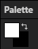
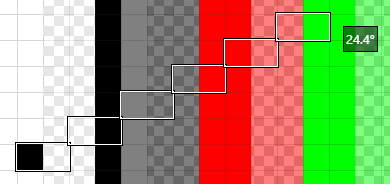

## Pencil Tool (<kbd>P</kbd>)

The _Pencil_ tool is used to draw individual pixels.

When active, left click will apply the primary color to the pixel under the cursor and right click will apply the secondary color. These colors can be configured in the palette window in the bottom left.

Holding shift enables drawing a line from the last drawn point, showing a preview of the line and what the angle is.

The pencil also supports _blend modes_ which can be configured in the top bar.
