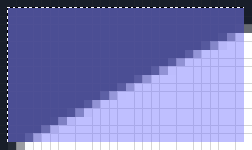
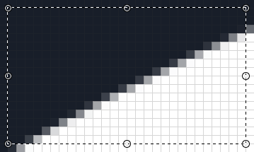

Selections in Luna Paint enable lots of different functionality such as:

- Preventing modifications from being made outside the selection
- Cropping an image
- Moving or scaling part of an image

## Selection Tool (<kbd>S</kbd>)

The standard way to create a selection is by using the _Selection_ tool.

When the selection tool is active, clicking and dragging will make a selection. Once you have a selection this will affect many different things in the editor, for example if you try to draw with the pencil it will only allow changes to happen within the selection.

> ℹ️ <kbd>ctrl/cmd+a</kbd> will select all, just like in the editor.

## Move Selection Tool (<kbd>M M</kbd>)

If a mistake was made with the selection, the _Move Selection_ tool can move and change its dimensions with the circle hot zones on the edges.

## Move Pixels Tool (<kbd>M M</kbd>)

Moving and scaling the selection can be done with the _Move Pixels_ tool. Drag the image from the center to move it, or from the edges to scale.

> ℹ️ When _manipulating the selection_ it has a blue hue, when _moving pixels_ the selection will goes transparent so the end result of the move/scale action is more clear.
