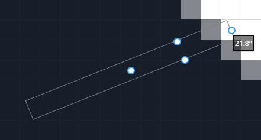

## Line Tool (<kbd>O</kbd>)

The _Line_ tool enables drawing straight lines, left click will use the primary color and right click will use the secondary color.

Holding shift while the line tool is active will restrict the line's angle to the nearest 15°. Holding alt while the line tool is active will use the anchor as the center, doubling the length of the line.

When a line is drawn, handles appear which allow manipulating the line's. Various options are available to configure how the line is drawn such as brush size.

Among the options is smoothing which will disable anti-aliasing, when smoothing is disabled and stroke width is 1px the tool uses a special drawing mode that results in a pixel perfect line and guide.

The bottom bar contains information about the line being drawn.

