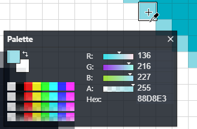
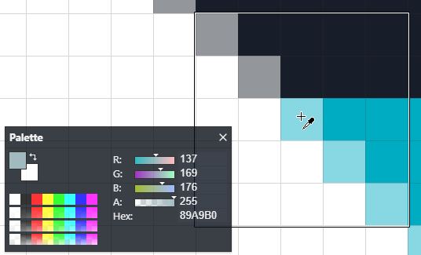

## Color Picker Tool (<kbd>K</kbd>)

The _Color Picker_ tool, also known as the eye dropper, allows sampling a layer's individual pixels for their color. Left click will put set the primary color and right click will set the secondary color.

Change the _sampling_ option in the top bar allows picking the average of colors over a range of pixels.

