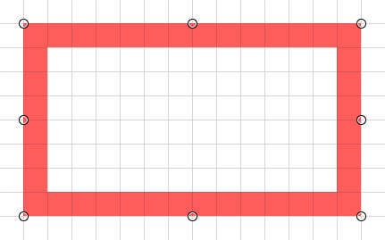
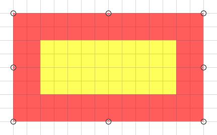
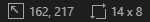

## Rectangle Tool (<kbd>O O</kbd>)

The _Rectangle_ tool is used to draw a rectangle and manipulate it within the canvas, left click will use the primary color and right click will use the secondary color.

> ℹ️ Holding shift while the rectangle tool is active will lock the aspect ratio to a square for new rectangles, or the previous aspect ratio if resizing.

Options in the top bar include blend mode, style (fill, outline or both) and outline size. These options can be configured even after drawing the rectangle.

Contextual information about the active rectangle is shown in the bottom bar.

