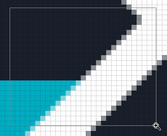

Viewport tools help navigate around the image by scrolling and zooming.

## Hand Tool (<kbd>H</kbd>)

The _Hand_ tool is used to pan the viewport using left click. It can be switched to temporarily by holding <kbd>space</kbd>.

> ℹ️ Panning the viewport can also be done using the mouse wheel (vertical) and <kbd>shift</kbd>+mouse wheel. 

## Zoom Tool (<kbd>Z</kbd>)

The _Zoom_ tool allows zooming the viewport in with left click and zooming out with right click.

Holding left click and dragging can be used to zoom into a rectangle drawn onto the canvas.

> ℹ️ The setting `"luna.mouseWheelBehavior": "zoom"` can be used to make the mouse wheel's zoom without holding <kbd>ctrl</kbd>/<kbd>⌘</kbd>
