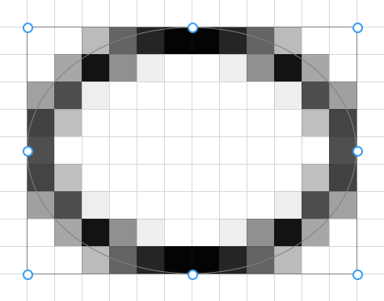
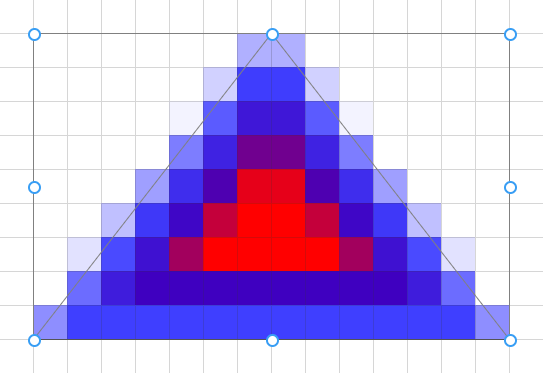
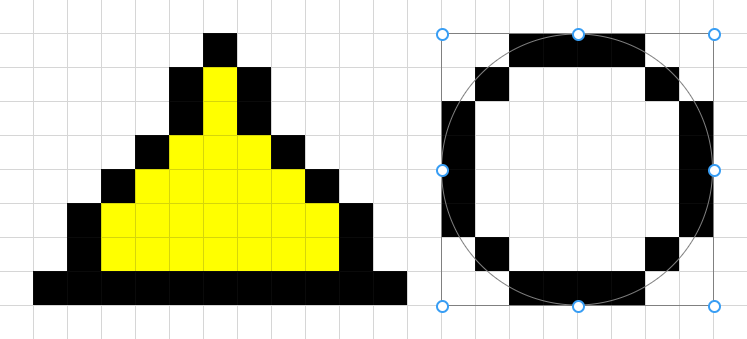

## Shape Tool (<kbd>O O O</kbd>)

The _Shape_ tool is used to draw various shapes and manipulate them within the canvas, left click will use the primary color and right click will use the secondary color.

> ℹ️ Holding shift while the shape tool is active will lock the aspect ratio to a square for new shapes, or the previous aspect ratio if resizing.

When a shape is drawn, handles appear which allow manipulating the shape's dimensions. Various options are available to configure how the shape is drawn.

Among the options is smoothing which will disable anti-aliasing, when smoothing is disabled and stroke width is 1px the tool uses a special drawing mode that results in pixel-perfect shapes contained within the rectangle.

Contextual information about the active shape is shown in the bottom bar.

